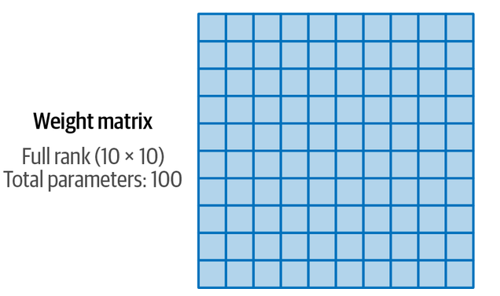
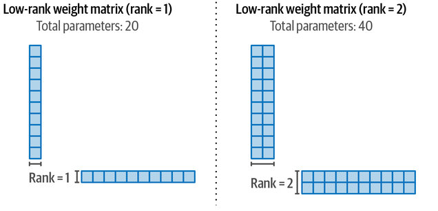
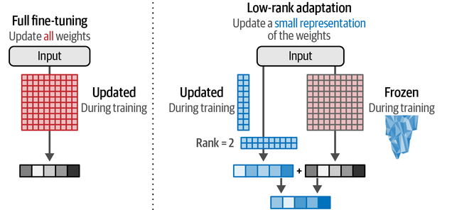

# genai-cookbook
## 📌 Table of Contents
1. [Introduction](#-introduction)
2. [🧭 Strategy & Scoping](#-strategy--scoping)
3. [🧱 Data Foundation](#-data-foundation)
4. [🔁 Iterative Development & Evaluation](#-iterative-development--evaluation)
   - [3.1 Foundation Model Selection & Baseline Evaluation](#31-foundation-model-selection--baseline-evaluation)
   - [3.2 Application Prototyping](#32-application-prototyping)
   - [3.3 Prompt Engineering & Optimization](#33-prompt-engineering--optimization)
   - [3.4 RAG System Development & Tuning](#34-rag-system-development--tuning)
   - [3.5 Fine-tuning](#35-fine-tuning)
     - [3.5.1 Dataset Preparation](#351-dataset-preparation)
     - [3.5.2 Training Setup](#352-training-setup)
     - [3.5.3 Model Initialisation](#353-model-initialisation)
     - [3.5.4 Selection of Fine-Tuning Technique](#354-selection-of-fine-tuning-technique)
   - [3.6 Comprehensive Evaluation](#36-comprehensive-evaluation)
5. [🚀 Productionization & Operations (LLMOps)](#-productionization--operations-llmops)
6. [🔍♻️ Continuous Monitoring & Improvement](#-continuous-monitoring--improvement)
7. [📚 Appendix](#-appendix-foundational-concepts)
7. [🤝 Contributing](#-contributing)
8. [📜 License](#-license)

## 📘 Introduction
This repository is a research-driven framework for adopting and fine-tuning Large Language Models (LLMs) effectively and responsibly.

Instead of jumping directly into fine-tuning, this project explores a <b>layered approach to LLM system design</b>, combining industry best practices, cost-effective techniques, and deep evaluations. It aims to help you decide <b>when to use prompt engineering, retrieval-augmented generation (RAG), or full/parameter-efficient fine-tuning</b>, based on your task, domain, and constraints.

The goal is to build a modular, extensible pipeline that supports experimentation, benchmarking, and eventual deployment of high-performing, domain-specific LLMs — while maintaining reproducibility, traceability, and practical relevance.


## 🧭 Strategy & Scoping
*(Coming Soon)*

## 🧱 Data Foundation
*(Coming Soon)*

## 🔁 Iterative Development & Evaluation

### 3.1 Foundation Model Selection & Baseline Evaluation
Following the establishment of a robust data foundation, the core development phase focuses on selecting an appropriate foundation model and adapting it to the specific use case through various techniques, all managed within an LLMOps framework.

The choice of the base LLM significantly impacts the application's capabilities, cost, and development trajectory. Key considerations include:
* <b>Proprietary vs. Open-Source:</b> Developers must choose between proprietary models offered via APIs (e.g., OpenAI's GPT series, Anthropic's Claude) and open-source models (e.g., Meta's Llama series, Mistral models 55) that allow for greater customization and local deployment.

* <b>Evaluation Criteria:</b> While general benchmarks provide a starting point, the "best" model is highly context-dependent. Performance can vary significantly across different tasks and domains. Therefore, it is crucial to create targeted evaluation sets that reflect the specific, real-world tasks the LLM will perform. Evaluating shortlisted models against these custom datasets before making a final selection is essential to ensure suitability and avoid investing resources in a suboptimal foundation.

* <b>Other Factors:</b> Cost structures (API call fees vs. hosting/compute costs), flexibility for fine-tuning, data privacy implications (especially with API-based models), built-in safety and alignment features, and licensing restrictions are also critical decision factors. Model Gardens and Hubs, such as Hugging Face and Google's Vertex AI Model Garden, serve as valuable resources for discovering and initially assessing available models.

---

### 3.2 Application Prototyping
---

### 3.3 Prompt Engineering
---

### 3.4 RAG System Development & Tuning
---
### 3.5 Fine-Tuning
---
#### 3.5.1 Dataset Preparation
---
#### 3.5.2 Training Setup
---
#### 3.5.2 Training Setup
---
#### 3.5.2.1 Hyperparameter Selection
The success of this fine-tuning process is critically dependent on the judicious selection and configuration of hyperparameters.Hyperparameters are external configuration settings that govern the learning process itself.

These settings act as control knobs, dictating how the model adapts its pre-existing knowledge to the new task or data distribution.

The choice of hyperparameters exerts a profound influence on the outcome of fine-tuning. <b>Inappropriate settings can lead to a cascade of undesirable effects, including model instability during training, failure to converge, slow convergence, or poor generalization characterized by overfitting (excelling on training data but failing on unseen data) or underfitting (failing to capture essential patterns even in the training data).</b> Consequently, meticulous hyperparameter tuning is not merely an optional refinement but a fundamental requirement for achieving optimal performance and reliable behavior in fine-tuned LLMs.

#### Dictionary of Core Fine-Tuning Hyperparameters
##### Learning Rate (LR):
The learning rate (LR), typically denoted by α, is arguably the most critical hyperparameter in gradient-based optimization. It is a scalar value that determines the step size taken during each iteration of the training process as the model attempts to minimize the loss function.

$$
\mathrm{w}_{t+1} = \mathrm{w}_t - \alpha \nabla L(\mathrm{w}_t)
$$

where wt​ represents the model weights at iteration t, and ∇L(wt​) is the gradient of the loss function with respect to those weights. The LR scales the magnitude of the adjustment made based on the gradient direction.

Setting the <b>LR too high</b> can cause the optimization process to become unstable, leading to oscillating loss values, divergence (where the loss increases indefinitely), or overshooting the optimal weight configuration.

setting the LR too low results in excessively slow convergence, potentially requiring an impractical number of training iterations, or causing the model to become trapped in suboptimal local minima, leading to underfitting.

<b>Practical Tips </b>
A common heuristic is to employ smaller learning rates during fine-tuning compared to those used during the initial pre-training phase. This practice is primarily motivated by the need to avoid catastrophic forgetting. 

A large LR permits substantial weight adjustments based on the fine-tuning data, potentially disrupting the carefully learned representations from pre-training. A smaller LR encourages more subtle adjustments, aiming to preserve the valuable pre-trained knowledge while gently guiding the model towards proficiency on the specific downstream task. This highlights a fundamental tension in fine-tuning: balancing adaptation to new specifics against the preservation of general capabilities. However, recent investigations into supervised fine-tuning (SFT) of smaller LLMs suggest a more complex interplay, where larger batch sizes might necessitate lower learning rates for optimal performance

<b>Common LR values for fine-tuning LLMs often fall within the range of 1×10−4 to 5×10−6.</b> The optimal value is highly dependent on the chosen optimizer (e.g., AdamW, Adafactor), the specific model architecture and size, and the nature of the fine-tuning task and dataset. A practical starting approach might involve selecting a value from the lower end of the typical range and gradually increasing it if convergence proves too slow, or starting slightly higher within the range and reducing it if instability is observed. It is standard practice to use dynamic learning rate schedules rather than a fixed LR throughout training.


##### Batch Size (BS): Gradient Quality, Computational Trade-offs, and Memory Implications:
The batch size (BS) refers to the number of training examples processed simultaneously in a single forward and backward pass through the model before the optimizer performs a weight update.

The size of the batch influences the quality of the gradient estimate used for weight updates. Larger batch sizes compute the gradient over more samples, providing a more accurate approximation of the true gradient across the entire dataset. This leads to more stable updates with lower variance (less noise). Smaller batch sizes yield noisier gradient estimates.

Imagine you're trying to estimate the average height of people in a city:
* If you sample 10 people, your estimate is noisy.
* If you sample 1000 people, your estimate is more stable and accurate.

Same with gradients:
* Larger batches (e.g., 512 samples): Average the gradient over many samples → Low variance, more stable updates.
* Smaller batches (e.g., 4 samples): Gradient is noisy because it's based on fewer examples → High variance, more fluctuation.

Batch size is a primary determinant of Graphics Processing Unit (GPU) memory (VRAM) consumption during training. This is largely due to the need to store the intermediate activations for each sample in the batch during the forward pass, which are required for gradient computation during the backward pass. I explained 
this part in the memory optimization Strategies.

So, </b>There direct link between batch size and VRAM makes it a critical hyperparameter constrained by the available hardware.</b>

Also, Batch size has a strong interplay with the learning rate. Larger batch sizes often permit or even require larger learning rates initially, while smaller, noisier batches typically necessitate smaller learning rates for stability. Furthermore, the technique of <b>Gradient Accumulation</b> is frequently employed to circumvent VRAM limitations, allowing the simulation of large effective batch sizes by accumulating gradients over multiple smaller "micro-batches" before performing a weight update.

[Good Read](https://arxiv.org/pdf/2412.13337v1)

##### Optimization Algorithms
Optimizers are algorithms that adaptively modify attributes of the learning process, such as the learning rate, for different parameters based on the history of gradients observed during training. Their goal is to guide the model weights towards a configuration that minimizes the loss function more efficiently and effectively than standard stochastic gradient descent (SGD). Methods like AdamW and Adafactor utilize estimates of the first moment (momentum) and second moment (adaptive scaling) of the gradients.

<b>AdamW</b>: 
AdamW (Adam with Decoupled Weight Decay) is currently one of the most widely adopted optimizers for training deep neural networks, including LLMs.17 It builds upon the Adam optimizer but modifies the handling of L2 regularization (weight decay). Instead of incorporating the weight decay term into the gradient calculation (as in Adam with L2 regularization), AdamW applies it directly to the weights after the gradient-based update step.

However, AdamW is memory-intensive. It typically requires storing two auxiliary variables (estimates of the first and second moments) for each model parameter, usually in 32-bit precision (FP32). This translates to approximately 8 bytes of additional memory per parameter, which can amount to substantial VRAM consumption for billion-parameter models. Memory-reduced variants, such as 8-bit AdamW (using quantization for optimizer states)  and paged AdamW (offloading to CPU RAM), have been developed to mitigate this. I also explained this part in upcoming section.

<b>Adafactor</b>: 
Adafactor was proposed as a memory-efficient alternative to AdamW, particularly suitable for large models. Its key innovation lies in avoiding the storage of the full second moment estimate for every parameter. Instead, it maintains only aggregated or factorized statistics (e.g., row-wise and column-wise sums of squared gradients or using techniques like Non-negative Matrix Factorization). This significantly reduces the memory footprint, requiring only slightly more than 4 bytes per parameter in some configurations

Assume you're optimizing this weight matrix:
```python
W = torch.randn(4, 4)  # 4x4 layer
```
AdamW stores:
m: 4x4 → 16 floats
v: 4x4 → 16 floats
➜ Total = 32 floats extra

Adafactor stores:
row_stats: 4 → 4 floats
col_stats: 4 → 4 floats
➜ Total = 8 floats instead of 32

Now, during the update:
Instead of using v[i][j] directly
You approximate it as:
```python
v_approx[i][j] = row_stats[i] * col_stats[j]
```

AdamW is generally considered robust and often achieves good convergence across various tasks. Adafactor, while offering significant memory savings, may sometimes exhibit slightly slower convergence or require more careful tuning of its own hyperparameters (like learning rate schedule and momentum settings) compared to AdamW.

Newer optimizers like Lion and Sophia have also been proposed, sometimes demonstrating competitive or superior performance in specific contexts, often with different memory profiles. Research into optimizers like FOCUS or simpler adaptive methods like Adalayer suggests that adaptivity might be most critical for specific parameter groups (e.g., layer normalization, output layer) in LLMs, opening avenues for further optimization research.

##### Learning Rate Schedulers (Cosine, Linear, Warmup)
Learning rate schedulers dynamically adjust the learning rate value over the course of pre-training or fine-tuning, rather than keeping it constant. This dynamic adjustment is crucial for balancing efficient learning with stable convergence and achieving optimal final model performance.

<span style="color:Olive">
A fixed learning rate is rarely the best strategy for training complex models like LLMs.
</span>

<b>Warmup Phase:</b> A nearly ubiquitous component of LR schedules for LLM training is the warmup phase. During warmup, the learning rate starts at a very small value (often close to zero) and gradually increases, typically linearly, to its target maximum value over a predefined number of initial training steps (specified either as an absolute number of steps or a ratio of total steps).  This initial ramp-up period is critical for stabilizing the training process, especially in the early stages where the model's initial state might be far from optimal, leading to large and potentially noisy gradients.

Adaptive optimizers like AdamW can be sensitive to such large initial gradients, and warmup prevents potential divergence or erratic behavior by allowing the optimizer's internal state (e.g., momentum estimates) to adapt gradually before the full learning rate is applied. 

<span style="color:Olive">
A typical warmup duration might span 5-10% of the total training steps 33 or a fixed number like 25, 100, 500, or 1000 steps.
</span>

<b>Decay Schedules:</b>
Following the warmup phase, the learning rate typically undergoes a decay phase, gradually decreasing towards a minimum value (often zero) over the remaining training duration. Common decay strategies include:
1. <b>Linear Decay:</b> The learning rate decreases linearly from its maximum value post-warmup down to the minimum value. This is a simple and frequently used schedule, mentioned, for instance, in the context of BERT training.

2. <b>Cosine Decay (Cosine Annealing):</b>  The learning rate follows the shape of a cosine curve, decreasing from the maximum to the minimum value. A key characteristic is that it maintains a relatively high learning rate for a longer portion of the decay phase before smoothly decreasing more rapidly towards the end. This schedule, sometimes used with "warm restarts" where the cycle repeats, has been popular for pre-training large models like BLOOM and Llama 3. 

<span style="color:Olive">
While cosine schedules are prevalent in pre-training, the optimal choice for fine-tuning might depend on the specific context. The aforementioned research suggesting constant LR after warmup might be sufficient for SFT with large batches 2 implies that the complexity of the decay phase might be less critical if gradients are already stabilized by the batch size. This could potentially simplify the hyperparameter search, focusing primarily on the warmup duration and the peak LR. However, linear or cosine decay remain safe and standard choices.
</span>
---

#### 3.5.3 Model Initialisation
---
#### 3.5.4 Memory Optimization Strategies
Imagine the standard deep learning training loop - forward pass, backward pass, optimizer step - as a journey for your data and model weights within the GPU. Let's track the memory usage at each stage:

##### Phase 1: Setting the Stage - Initialization & Model Loading
Before any training happens, we need to load the essentials onto the GPU. This establishes the static memory baseline - the minimum VRAM required just to exist.

1. <b>CUDA Context & Framework Overhead</b>: 
The deep learning framework (like PyTorch or TensorFlow) reserves a chunk of memory for its CUDA context. This isn't just an empty space; it holds compiled CUDA kernels, GPU libraries (cuDNN, cuBLAS), and the overhead from the framework's own memory management system.
2. <b>Model Parameters</b>: This is often the most significant static component. It's the memory needed to store all the weights and biases of your pre-trained transformer. This includes,
*Input Embeddings (embed_p)
* Transformer Layer Weights (other_p - attention, linear layers, normalization)
* Task-Specific Head (lm_p - language model head, classification head) * The size depends heavily on the model's architecture (depth, width, vocab size) and, crucially, the precision used:

$$
\mathrm{param\_memory} =
\begin{cases}
4~\text{bytes,} & \text{FP32} \\
2~\text{bytes,} & \text{FP16 or BF16} \\
1~\text{byte,} & \text{INT8} \\
0.5~\text{bytes,} & \text{NF4 (QLoRA)}
\end{cases}
$$

3. <b>Memory Padding:</b> Allocators don't usually grab exactly the requested memory. For efficiency (coalesced access, easier management, kernel requirements, MMU alignment), they round up allocations to align with hardware boundaries (like CUDA page sizes). This means some allocated memory might be unoccupied padding, slightly inflating the actual usage beyond the sum of parameter sizes.

$$
m_{\mathrm{base}} = m_{\mathrm{cuda_ctx}} + m_{\mathrm{framework}} + m_{\mathrm{libs}}
$$

> **_Note_** This initial phase sets a potentially high floor for memory usage, dominated by model parameters (mp​) and framework overhead (mb​ase). Optimizations here involve shrinking the model itself (Quantization, Parameter-Efficient Fine-Tuning - PEFT).

##### Phase 2: Data Arrives - Loading & Embedding
Now, the training loop begins. Batches of input data (tokenized sequences, often shaped [batch_size, sequence_length] or [bs, sl]) are moved to the GPU.

1. <b>Input Embedding Lookup:</b> The model's embedding layer (embed_p) converts token IDs into dense vectors.
2. <b>First Activations:</b> This lookup generates the first set of intermediate results, or activations. Their size is typically bs×sl×hidden_dim, using the compute precision (e.g., FP16/BF16 in mixed-precision).

$$
m_{\mathrm{embed}} = B \times S \times H \times \mathrm{dtype_size}
$$

> **_Note_**  This marks the start of dynamic memory allocation. Activation memory scales directly with batch size (bs) and sequence length (sl), making these key parameters to tune for memory management.

##### Phase 3: The Forward Pass - Climbing the Activation Mountain
The input embeddings flow through the transformer layers (other_p). Each layer computes outputs (more activations) that become the input for the next. Finally, the LM head (lm_p) generates logits (often bs×sl×vocab_size), and the loss is calculated.

1. Intermediate Activations (mout​): This is the memory holding the outputs of all intermediate layers (self-attention outputs, MLP outputs, layer norm outputs, etc.).
2. LM Head Outputs & Loss (mlm​): Includes the final logits, potentially targets moved to the GPU, and temporary variables used during loss calculation.

Unless gradient checkpointing a optimization techniques is used, all these intermediate activations (mout​) must be kept in memory simultaneously. Why we need them? They are needed during the backward pass to calculate gradients.

$$
m_{\mathrm{out}} = \sum_{l=1}^{L} A_l
$$

$$
\mathrm{logits_shape} = B \times S \times V
$$

> **_Note_** For deep models, long sequences, or large batches, activation memory (mout​) often becomes the dominant dynamic memory consumer, potentially exceeding parameter or optimizer state memory. Its sheer size makes it the prime target for techniques like Gradient Checkpointing.

##### Phase 4: The Backward Pass - Gradients and the Optimizer State Surprise
Starting from the loss, gradients are computed backward through the network.
Gradient Computation: The derivative of the loss is calculated with respect to each layer's output and, critically, with respect to each trainable model parameter.
1. <b>Gradient Storage (mg​)</b>: Memory is allocated to store these gradients (dLoss/dWeight) for all trainable parameters. The size is proportional to the number of parameters being updated.
2. Optimizer State Allocation (mos​)</b>: The One-Time Hit: During the first backward pass, the optimizer allocates memory for its internal states. For Adam/AdamW, this typically means:
* Momentum (m): First moment estimate (average of past gradients).
* Variance (v): Second moment estimate (average of past squared gradients). These are usually stored in FP32for numerical stability, even in 

$$
m_g = P_{\mathrm{train}} \times \mathrm{dtype_size}
$$

$$
m_{\mathrm{os}} = P_{\mathrm{train}} \times 8
$$


> **_Note_** Gradient memory (mg​) scales with trainable parameters, making PEFT highly effective here. Optimizer states (mos​) represent a significant, persistent memory cost established early on, making optimizer choice critical.

##### Phase 5: The Optimizer Step - Updating Weights
The optimizer uses the computed gradients (mg​) and its stored states (mos​) to update the model parameters (mp​).
1. Parameter Update: Calculations are performed (e.g., applying momentum, variance correction, weight decay) and the results are written back to the model's parameters.
2. Memory Fluctuation: Memory usage might slightly decrease after this step if the gradient buffers (mg​) are released (this depends on the framework's memory management). However, the large optimizer state memory (mos​) remains.

$$
m_{\mathrm{after_update}} \approx m_{\mathrm{base}} + m_p + m_{\mathrm{os}} + c_{\mathrm{up}}
$$


> **_Note_** The optimizer step completes the cycle. The persistent nature of optimizer states (mos​) highlights the value of memory-efficient optimizers.

$$
m_{{\mathrm{after\_update}}} \approx m_{{\mathrm{base}}} + m_p + m_{{\mathrm{os}}} + \max(m_{{\mathrm{out}}}, m_g) + c_{{\mathrm{up}}}
$$


The followed section aims to provide a comprehensive and in-depth overview of the techniques, tools, benchmarks, and best practices for optimizing the fine-tuning process of LLMs, specifically targeting hardware environments with limited compute capacity.

The primary consumers of GPU VRAM during the training process are the model's parameters, the optimizer states required for parameter updates, the gradients computed during backpropagation, and the intermediate activations generated during the forward pass.12 Various strategies have been developed to target one or more of these components, thereby reducing the overall memory footprint.

#### 3.5.5.1 Gradient Checkpointing (Activation Recomputation)
Gradient checkpointing, also known as activation recomputation, is a technique specifically designed to reduce the memory consumed by storing intermediate activations. In standard backpropagation, all activations calculated during the forward pass are typically stored in VRAM to be readily available for gradient computation in the backward pass.

Gradient checkpointing mitigates this by strategically saving (checkpointing) activations only at specific layers within the network. During the backward pass, if the activations for a non-checkpointed layer are required, they are recomputed on-the-fly, starting from the nearest preceding checkpoint. This recomputation avoids storing all activations simultaneously.

The fundamental trade-off inherent in gradient checkpointing is between memory usage and computational time. By discarding and recomputing activations, VRAM usage is significantly reduced, with the extent of savings dependent on the checkpointing frequency. However, the recomputation introduces additional forward passes during the backward step, increasing the overall computation time per training iteration. This slowdown is often estimated to be between 20% and 50%.

For smaller models or scenarios where memory is not the absolute bottleneck, the computational overhead might negate the benefits of a larger batch size, potentially leading to slower overall training.36 However, for large models (e.g., 8B parameters) fine-tuned on multi-GPU setups, gradient checkpointing has been shown to dramatically increase the feasible batch size (e.g., from 2 to 12 or 14 per GPU), even if the time per epoch might still be longer compared to a smaller-batch run without checkpointing.

To enable gradient checkpointing in the 🤗 Trainer, pass the corresponding a flag to 🤗 TrainingArguments:
```python
training_args = TrainingArguments(
    .., gradient_checkpointing=True, **default_args
)
```
---
#### 3.5.5.2 Gradient Accumulation
Gradient accumulation is a technique used to compute gradients in smaller chunks rather than processing the entire batch at once. In this method, the model performs forward and backward passes on smaller mini-batches, accumulating the gradients over several iterations. Once the desired number of mini-batches has been processed, the optimizer updates the model parameters. This approach allows the use of larger effective batch sizes than what the GPU memory can typically handle. However, it's worth noting that the extra forward and backward passes required for accumulation can lead to slower training times.

> **_IMPORTANT_** Its also a hyperparameter used for improving your fine-tuning task. </b>The primary motivation for using gradient accumulation is to simulate the effect of training with a larger batch size than can physically fit into the GPU memory at once.</b>

The "effective batch size" achieved is the product of the per-device batch size (micro-batch size) and the number of gradient accumulation steps: Effective_Batch_Size = per_device_train_batch_size * gradient_accumulation_steps. This technique allows practitioners to leverage the potential benefits of large batch training (e.g., more stable gradients, potentially better performance as suggested by recent SFT research) even when using hardware with limited VRAM.38 It is often a necessary technique for fine-tuning large LLMs or achieving very large effective batch sizes on standard GPUs.


```python
training_args = TrainingArguments(
      .., gradient_accumulation_steps=4, **default_args)
```

Let's compare the memory and compute trade-offs of Gradient Checkpointing and Gradient Accumulation

```bash
# Baseline
==================================================
Starting training with config:
  batch_size: 1
  gradient_accumulation_steps: 1
  learning_rate: 5e-05
  weight_decay: 0.0
  fp16: False
  bf16: False
  gradient_checkpointing: False
  max_grad_norm: 1.0
  model_type: gpt2
  hidden_size: 1024
  num_hidden_layers: 24
  num_attention_heads: 16
==================================================

==================================================
Training completed!
Total training time: 468.57 seconds
Epochs completed: 3
Steps completed: 1101
Peak GPU memory: 8114.69 MB
Average GPU memory: 8032.53 MB
==================================================

# With Gradient checkpointing & Accumulation

==================================================
Starting training with config:
  batch_size: 1
  gradient_accumulation_steps: 4
  learning_rate: 5e-05
  weight_decay: 0.0
  fp16: False
  bf16: False
  gradient_checkpointing: True
  max_grad_norm: 1.0
  model_type: gpt2
  hidden_size: 1024
  num_hidden_layers: 24
  num_attention_heads: 16
==================================================

==================================================
Training completed!
Total training time: 528.48 seconds
Epochs completed: 3
Steps completed: 1101
Peak GPU memory: 7960.75 MB
Average GPU memory: 7894.72 MB
==================================================
```

This comparison demonstrates that for GPT-2 Medium, the memory savings from gradient checkpointing are relatively modest compared to the performance impact. These optimizations would likely show more significant memory benefits on larger models or with larger batch sizes.

---

#### 3.5.5.3 Mixed Precision Training (FP16/BF16)
Mixed precision training involves performing computations and storing weights and activations using lower-precision floating-point formats, namely 16-bit formats like FP16 (half-precision) or BF16 (Brain Floating Point), instead of the standard 32-bit single-precision (FP32).

This approach offers two primary benefits:
* Reduced Memory Footprint: Storing parameters, activations, and gradients in 16-bit formats effectively halves the memory required compared to FP32, freeing up significant VRAM.15
* Faster Computation: Modern GPUs, particularly those with NVIDIA Tensor Cores, are optimized for lower-precision computations, leading to substantial speedups in matrix multiplications and convolutions.34

While both FP16 and BF16 use 16 bits, they differ in their representation, leading to distinct characteristics
* Numerical Range: BF16 allocates more bits to the exponent, providing a numerical range similar to FP32. This makes it less susceptible to underflow and overflow issues during training, often eliminating the need for loss scaling.
* Precision: FP16 allocates more bits to the mantissa, offering higher precision (ability to represent numbers with finer detail) than BF16.38
* Loss Scaling: Due to its narrower range, FP16 training often requires loss scaling – multiplying the loss by a scaling factor before backpropagation and unscaling the gradients before the optimizer step – to prevent gradients from becoming zero (underflow). BF16 typically avoids this complexity.
* Conversion Speed: BF16 conversion to/from FP32 is generally faster as it shares the same exponent range, essentially involving truncation or padding of the mantissa. FP16 conversion is more complex.
* Hardware Support: FP16 support is widespread. BF16 support is typically found on newer architectures like NVIDIA Ampere (A100, RTX 30 series) and subsequent generations.

For example, 
```python
# FP16
training_args = TrainingArguments(.., fp16=True, **default_args)

# BF16
training_args = TrainingArguments(.., bf16=True, **default_args)
```
These implementation is usually handled by Automatic Mixed Precision (AMP) libraries, such as PyTorch's built-in torch.amp or NVIDIA's Apex library.

There is one more type called tf32 t has the same numerical range as fp32 (8-bits), but instead of 23 bits precision it has only 10 bits (same as fp16) and uses only 19 bits in total. It’s “magical” in the sense that you can use the normal fp32 training and/or inference code and by enabling tf32 support you can get up to 3x throughput improvement. All you need to do is to add the following to your code:

```python
import torch
torch.backends.cuda.matmul.allow_tf32 = True
torch.backends.cudnn.allow_tf32 = True
```

You can enable this mode in the 🤗 Trainer:
```python
training_args = TrainingArguments(.., tf32=True, **default_args)
```

Let's compare the memory and compute trade-offs of Gradient Checkpointing, Gradient Accumulation and the Mixed Precision, 
```bash
# Baseline
==================================================
Starting training with config:
  batch_size: 1
  gradient_accumulation_steps: 1
  learning_rate: 5e-05
  weight_decay: 0.0
  fp16: False
  bf16: False
  gradient_checkpointing: False
  max_grad_norm: 1.0
  model_type: gpt2
  hidden_size: 1024
  num_hidden_layers: 24
  num_attention_heads: 16
==================================================
==================================================
Training completed!
Total training time: 470.13 seconds
Epochs completed: 3
Steps completed: 1101
Peak GPU memory: 8148.88 MB
Average GPU memory: 8071.29 MB
==================================================

#  With Gradient checkpointing, Accumulation and Mixed Precision
==================================================
Training completed!
Total training time: 387.06 seconds
Epochs completed: 3
Steps completed: 1101
Peak GPU memory: 7902.31 MB
Average GPU memory: 7801.63 MB
==================================================
```
FP16 fine-tuning is the primary contributor to compute time in this process.
---
#### 3.5.5.4 Efficient Optimizers and State Compression
Standard optimizers like AdamW contribute significantly to VRAM usage because they maintain auxiliary information, or "states," for each model parameter being trained. For AdamW using FP32, this typically involves storing momentum and variance estimates, requiring an additional 8 bytes per parameter on top of the parameter itself, totaling 12 bytes/param. Even with mixed precision where parameters might be FP16, the optimizer states are often kept in FP32 for stability, still consuming considerable memory (e.g., 8 bytes/param for states).

Several optimizers offer improved memory efficiency:
* AdamW: The standard baseline, known for good performance but high memory consumption (e.g., for a 3B parameter model, ~24GB VRAM just for the optimizer states if using FP32 states).
* Adafactor: Developed to be more memory-efficient than AdamW.35 It avoids storing full momentum and variance vectors, instead using factorized or aggregated statistics, reducing memory usage to slightly more than 4 bytes per parameter (e.g., >12GB for a 3B model).
```python
training_args = TrainingArguments(.., optim="adafactor", **default_args)
```
* 8-bit Optimizers: Implemented in libraries like bitsandbytes, these optimizers (e.g., AdamW8bit) store the optimizer states (momentum, variance) using 8-bit precision.16 The states are dequantized only during the parameter update step. This drastically reduces the memory required for optimizer states to approximately 2 bytes per parameter (e.g., ~6GB for a 3B model), offering significant savings compared to AdamW or even Adafactor.
```python
training_args = TrainingArguments(.., optim="adamw_bnb_8bit", **default_args)
```
* Paged optimizers: Address the GPU memory bottleneck by offloading optimizer states such as moment estimates in Adam to CPU RAM when theyre not actively needed on the GPU. This approach is inspired by virtual memory management in operating systems, where data is paged between RAM and disk as needed.

```python
training_args = TrainingArguments(.., optim="paged_adamw_8bit", **default_args)
```

```python
# Benchmark config
optimizer_configs = [
    {"name": "baseline", "fp16": False, "gradient_checkpointing": False},
    {"name": "adafactor",
     "fp16": True, 
     "gradient_checkpointing": True, 
     "gradient_accumulation_steps": 1,
     "optim": "adafactor"},
    {"name": "adamw_bnb_8bit",
     "fp16": True, 
     "gradient_checkpointing": True, 
     "gradient_accumulation_steps": 1,
     "optim": "adamw_bnb_8bit"},
    {"name": "paged_adamw_8bit",
     "fp16": True, 
     "gradient_checkpointing": True, 
     "gradient_accumulation_steps": 1,
     "optim": "paged_adamw_8bit"},
]
```
| Optimizer           | Train Time (s) | Avg GPU (MB) | Peak GPU (MB) | Train Loss | Eval Loss (Final) | Throughput (steps/s) |
|---------------------|----------------|---------------|----------------|-------------|--------------------|------------------------|
| AdamW (baseline)    | 464.05         | 12141.47      | 12197.06       | 0.6911      | 0.6898             | 2.37                   |
| Adafactor           | 387.97         | 8409.51       | 8513.69        | 0.7478      | 0.6900             | 2.83                   |
| AdamW BnB 8-bit     | 309.66         | 8794.61       | 8865.25        | 0.7591      | 0.6915             | 3.55                   |
| Paged AdamW 8-bit   | 321.74         | 9143.26       | 9371.75        | 0.7591      | 0.6915             | 3.42                   |

Obseervations are,
##### Speed vs Accuracy Tradeoff:
* AdamW (fp32) gives the best final training loss (0.6911) and slightly better eval loss but at highest memory and time cost.
* 8-bit optimizers (AdamW BnB & Paged AdamW) achieved ~33% faster training, using ~30% less GPU memory.

##### Adafactor:
* Performs very well on memory, lowest usage.
* Slightly higher train/eval loss compared to AdamW, but faster and more memory efficient.
* Good choice for low-resource environments.

##### 8-bit Optimizers (bnb_8bit & paged_adamw_8bit):
* Ideal if you're optimizing for training speed and memory efficiency without significantly compromising on final performance.
* PagedAdamW uses slightly more memory than adamw_bnb_8bit, likely due to the paging mechanism overhead.

[Want to try out - benchmark code](./finetune/experiments/optimization/benchmark_v1.0.py)

---

#### 3.5.5.5 Sharding & Offloading Techniques
Memory offloading strategies involve moving parts of the model's state – parameters, gradients, and optimizer states – from the limited GPU VRAM to the host system's larger memory pools, typically CPU RAM or, more recently, fast NVMe (Non-Volatile Memory Express) SSD storage.

This allows training models that are far too large to fit entirely within the collective memory of the available GPUs.

DeepSpeed, particularly through its ZeRO optimizer stages, provides sophisticated offloading capabilities:
* ZeRO-Offload: Introduced as part of ZeRO-2, this system focuses on offloading the optimizer states and gradient computations to the CPU RAM. This frees up GPU memory primarily consumed by these components.

* ZeRO-Infinity: An extension built upon ZeRO-3, ZeRO-Infinity enables offloading of all model states – parameters, gradients, and optimizer states – to either CPU RAM or NVMe storage. It employs intelligent partitioning and scheduling to manage data movement between the GPU and the host memory/storage, aiming for better bandwidth utilization and overlap between computation and communication compared to ZeRO-Offload.ZeRO-Infinity requires the use of ZeRO stage 3.

> **_Note_** FSDP, or "Fully Sharded Data Parallel," was initially developed by Facebook AI Research and introduced through the Fairscale library. Native support was later integrated into PyTorch starting with version 1.11.
Its core functionality mirrors that of DeepSpeed ZeRO — efficiently sharding optimizer states, gradients, and model parameters to reduce memory usage. It also includes support for CPU offloading. A notable advantage of FSDP is that it can be used as a drop-in replacement for DistributedDataParallel, simplifying integration into existing distributed training workflows.

It is a good idea to check whether you have enough GPU and CPU memory to fit your model. DeepSpeed provides a tool for estimating the required CPU/GPU memory.

```bash
python -c 'from transformers import AutoModel; \
from deepspeed.runtime.zero.stage3 import estimate_zero3_model_states_mem_needs_all_live; \
model = AutoModel.from_pretrained("bigscience/T0_3B"); \
estimate_zero3_model_states_mem_needs_all_live(model, num_gpus_per_node=1, num_nodes=1)'

# Output
To enable the following instructions: AVX2 FMA, in other operations, rebuild TensorFlow with the appropriate compiler flags.
Estimated memory needed for params, optim states and gradients for a:
HW: Setup with 1 node, 1 GPU per node.
SW: Model with 354M total params, 51M largest layer params.
  per CPU  |  per GPU |   Options
    8.92GB |   0.19GB | offload_param=cpu , offload_optimizer=cpu , zero_init=1
    8.92GB |   0.19GB | offload_param=cpu , offload_optimizer=cpu , zero_init=0
    7.93GB |   0.85GB | offload_param=none, offload_optimizer=cpu , zero_init=1
    7.93GB |   0.85GB | offload_param=none, offload_optimizer=cpu , zero_init=0
    0.29GB |   6.14GB | offload_param=none, offload_optimizer=none, zero_init=1
    1.98GB |   6.14GB | offload_param=none, offload_optimizer=none, zero_init=0
```
If my GPU has ≥6 GB VRAM, go for:
offload_param=none, offload_optimizer=none, zero_init=1
→ Fastest and most efficient for training speed.

If am limited on GPU memory (e.g., <4 GB VRAM), use:
offload_param=cpu, offload_optimizer=cpu, zero_init=1
→ Will be slower, but lets you train without OOM errors.

Let's compare the memory and compute trade-offs of various offloding techniques, 

### GPT2-Medium Optimization Benchmark Results

| Strategy                        | Train Time (s) | Avg GPU (MB) | Peak GPU (MB) | Train Loss | Eval Loss (Final) | Throughput (steps/s) |
|--------------------------------|------------------:|----------------:|-----------------:|---------------:|----------------------:|------------------------:|
| **AdamW (baseline)**           | 151.18            | 8103.41         | 8209.62          | 1.0705         | 0.7026                | 2.428                   |
| **FP16 + Gradient Checkpoint** | 97.29             | 8049.62         | 8235.88          | 1.1514         | —                     | 0.936                   |
| **ZeRO-1**                     | 85.86             | 10455.24        | 10710.50         | 1.5377         | —                     | 1.06                    |
| **ZeRO-2 + Offload Optimizer** | 162.99            | 10678.60        | 10798.94         | 1.5141         | —                     | 0.558                   |
| **ZeRO-3 + Full Offload**      | 258.11            | 3720.13         | 3809.00          | 1.6483         | —                     | 0.353                   |

[Want to try out - benchmark code](./finetune/experiments/optimization/deepspeed_exp/benchmark_v1.0.py)

#### 3.5.5.6 Zeroth-Order Optimization (MeZO, DiZO, SubZero)
Zeroth-Order (ZO) optimization presents a fundamentally different approach to training neural networks, potentially offering extreme memory efficiency by avoiding the standard backpropagation algorithm.

1. The core idea behind ZO methods is to estimate the gradient of the loss function with respect to the model parameters using only forward passes, treating the model essentially as a black box.6 Instead of calculating the exact gradient via backpropagation, ZO techniques typically work by:
Perturbing the model parameters θ slightly in one or more random directions (e.g., using a random vector z).
2. Evaluating the model's loss function L using these perturbed parameters (e.g., L(θ+ϵz) and potentially L(θ−ϵz)).
3. Using the observed changes in the loss value to estimate the gradient ∇L(θ). A common technique is Simultaneous Perturbation Stochastic Approximation (SPSA), which uses two forward passes with opposing perturbations to estimate the gradient.81

The primary memory saving of ZO methods comes from completely bypassing the need for backpropagation. Backpropagation requires storing intermediate activations from the forward pass to compute gradients, which is the dominant memory consumer in standard LLM fine-tuning. By relying solely on forward passes, ZO methods eliminate this activation memory overhead, potentially reducing memory costs significantly (e.g., up to 12x reduction claimed relative to FO methods, primarily due to activation savings). This makes ZO attractive for fine-tuning extremely large models on memory-constrained hardware.

##### MeZO (Memory-Efficient ZO): 
A foundational approach applying ZO to LLMs. It uses SPSA with full-parameter perturbation to estimate the gradient and updates parameters using ZO-SGD.81 While demonstrating the feasibility of ZO fine-tuning, MeZO often suffers from slow convergence. The variance of its gradient estimate typically scales with the model dimension, which is very high for LLMs, requiring many iterations for stable updates.6

##### DiZO (Divergence-aware ZO): 
Aims to accelerate MeZO's convergence. It analyzes the layer-wise differences ("divergence") between typical ZO updates and standard First-Order (FO) updates obtained via backpropagation. Based on this analysis, DiZO introduces a layer-wise adaptation mechanism (e.g., scaling factors) to make the ZO gradient estimates more closely align with FO gradients, particularly in terms of update magnitudes across layers.6 This is claimed to significantly reduce the number of training iterations needed for convergence, cutting training time (GPU hours) by up to 48% compared to 
MeZO and sometimes achieving accuracy comparable to or even exceeding FO fine-tuning.6

##### SubZero (Subspace ZO):
Addresses the high-dimensionality challenge differently. Instead of perturbing all parameters simultaneously, SubZero performs ZO optimization within randomly selected, low-dimensional subspaces of the parameter space, often using layer-wise low-rank perturbations.80 This approach aims to reduce the variance of the gradient estimate compared to full-parameter methods like MeZO, leading to faster convergence. It also further reduces memory consumption compared to MeZO by only needing to store and manipulate the low-rank perturbation matrices. SubZero is designed to be compatible with various fine-tuning schemes, including full-parameter tuning and PEFT methods like LoRA.

---
#### 3.5.5.7
FlashAttention-2 is a highly optimized version of the standard attention mechanism, designed to significantly accelerate inference by:
* Further parallelizing attention computation across the sequence length
* Efficiently distributing workloads among GPU threads to minimize communication and reduce shared memory read/write overhead.

> **_Note_** FlashAttention can only be used for models with the fp16 or bf16 torch type, so make sure to cast your model to the appropriate type first. The memory-efficient attention backend is able to handle fp32 models.

```python
model = AutoModelForCausalLM.from_pretrained(
    model_id,
    torch_dtype=torch.bfloat16,
    attn_implementation="flash_attention_2",
)
```
#### 3.5.5 Selection of Fine-Tuning Technique
As you know these models, often pre-trained on vast datasets, exhibit impressive generalization abilities, allowing them to perform tasks not explicitly seen during training, a capability known as zero-shot learning. However, to achieve optimal performance on specific downstream tasks or adapt to particular domains, fine-tuning remains an essential step.

Full fine-tuning demands substantial GPU memory not only for model weights but also for gradients, optimizer states, and intermediate activations, limiting its feasibility, especially outside large industrial labs.

Parameter-Efficient Fine-Tuning (PEFT) methods have emerged as a compelling solution to this challenge.1 PEFT techniques involve adjusting only a small subset of the model's parameters while keeping the vast majority frozen.

Concurrently, techniques based on Reinforcement Learning from Human Feedback (RLHF) and related preference optimization methods like Direct Preference Optimization (DPO) and Odds Ratio Preference Optimization (ORPO) have been developed to align LLM behavior more closely with human expectations and preferences, addressing issues like helpfulness, honesty, and harmlessness.

#### 3.5.5.1 Parameter-Efficient Fine-Tuning (PEFT)
The motivation for PEFT stems directly from the challenges posed by full fine-tuning of large models. Updating all parameters requires immense computational power and GPU memory to store not only the weights but also the gradients, optimizer states (like momentum and variance in Adam), and forward activations needed for backpropagation. Storing checkpoints for fully fine-tuned models also consumes significant disk space. The memory requirements for full finetuning has been discussed above.

Furthermore, fine-tuning all parameters on smaller, task-specific datasets increases the risk of catastrophic forgetting, where the model loses some of its general capabilities learned during pre-training. PEFT methods mitigate these issues as well.

PEFT techniques can be broadly categorized based on how they achieve parameter efficiency:
1. <b>Additive Methods:</b> These techniques introduce new, trainable parameters or modules into the pre-trained model architecture while keeping the original weights frozen. 
* Adapters: Small neural network layers inserted within the existing transformer blocks. 

* Soft Prompts: Methods like Prompt Tuning, Prefix-Tuning, and P-Tuning add trainable embedding vectors to the input or intermediate layers, effectively learning a task-specific prompt or prefix without modifying the base model's weights.

2. <b>Selective Methods:</b> These methods select a small subset of the existing pre-trained model parameters to fine-tune, while freezing the rest. Examples include tuning only specific layers (e.g., the final transformer blocks) 3 or specific parameter types like bias vectors (BitFit).

3. <b>Reparameterization Methods:</b> These techniques re-parameterize the model's weight matrices, often using low-rank representations to approximate the weight updates. The most prominent example is Low-Rank Adaptation (LoRA).

#### 3.5.5.1.1 Additive Methods - Adapters
Adapters represent one of the earliest and foundational additive PEFT methods. The core idea is to insert small, task-specific trainable modules into a frozen pre-trained model, typically within each layer of the Transformer architecture. This is similar to how we fine tune deeplearning for computer vision task. 

It works as follows:
1. Down-projection: Shrinks the high-dimensional input vector from size d to a smaller size r.
2. Activation: Applies a non-linear function (like ReLU or GELU).
3. Up-projection: Expands the vector back from size r to size d.
4. Residual connection: Adds the adapter output back to the original input, so the final output is close to the original plus a small learned update.
5. Only the adapter's weights (W_{down}, W_{up}) are trained during fine-tuning. The rest of the model stays frozen.

Given an input x, the adapter module computes:

$$
\text{Adapter}(x) = W_{\text{up}} \cdot \sigma(W_{\text{down}} \cdot x) + x
$$

---


```python
class Adapter(nn.Module):
    def __init__(self, d_model, bottleneck_dim):
        super().__init__()
        self.down_proj = nn.Linear(d_model, bottleneck_dim)
        self.activation = nn.ReLU()  # or GELU
        self.up_proj = nn.Linear(bottleneck_dim, d_model)

    def forward(self, x):
        return self.up_proj(self.activation(self.down_proj(x)))
```

```python
# Transformer block with adapter
class TransformerBlock(nn.Module):
    def __init__(self, cfg):
        super().__init__()
        self.att = MultiHeadAttention(
            d_in=cfg["emb_dim"],
            d_out=cfg["emb_dim"],
            context_length=cfg["context_length"],
            num_heads=cfg["n_heads"], 
            dropout=cfg["drop_rate"],
            qkv_bias=cfg["qkv_bias"]
        ).
        self.ff = FeedForward(cfg)
        self.norm1 = LayerNorm(cfg["emb_dim"])
        self.norm2 = LayerNorm(cfg["emb_dim"])
        self.drop_shortcut = nn.Dropout(cfg["drop_rate"])

        # Add adapters inside residuals
        self.adapter_attn = Adapter(cfg["emb_dim"], cfg["adapter_dim"])
        self.adapter_ffn = Adapter(cfg["emb_dim"], cfg["adapter_dim"])

    def forward(self, x):
        # ---- Attention block ----
        shortcut = x
        x_norm = self.norm1(x)
        attn_out = self.att(x_norm)
        attn_out = self.drop_shortcut(attn_out)
        x = shortcut + self.adapter_attn(attn_out)

        # ---- FFN block ----
        x_norm = self.norm2(x)
        ff_out = self.ff(x_norm)
        ff_out = self.drop_shortcut(ff_out)
        x = shortcut + self.adapter_ffn(ff_out)

        return x
```

<b>Placement Variants is also matters:</b>
Adapters can be inserted at different locations within a Transformer block. The original "Serial Adapter" approach placed adapters after both the multi-head self-attention (MSA) and feedforward network (FFN) sublayers.

To improve efficiency, variations like AdapterFusion proposed inserting adapters only after the FFN layer. Parallel Adapter (PA) approaches organize adapters into a side-network running alongside the main transformer sublayers, potentially improving computational parallelism. Specific parallel designs include CIAT, CoDA (which uses sparse activation for efficiency), and KronA.

---
To illustrate the difference between full fine-tuning and adapter-based fine-tuning, let’s walk through a real example using GPT-2 Medium and the CodeAlpaca-20K dataset.

The full fine-tuning code loads the entire GPT-2 model and updates all model parameters, including attention, feedforward layers, and embeddings.

```python
from transformers import AutoModelForCausalLM, AutoTokenizer

model_name = "gpt2-medium"
tokenizer = AutoTokenizer.from_pretrained(model_name)
model = AutoModelForCausalLM.from_pretrained(model_name)

# Tokenizer padding
if tokenizer.pad_token is None:
    tokenizer.pad_token = tokenizer.eos_token
```

In the adapter-based fine-tuning setup, we do not update the full model. Instead, we insert small adapter modules within each transformer block.

```python
class AdapterLayer(torch.nn.Module):
    """
    Implementation of an adapter layer for transformer models.
    input_dim: Dimension of the hidden state (e.g., 1024 in GPT2-Medium).
    adapter_dim: Bottleneck size — much smaller than input_dim, e.g., 64 or 128.
    dropout_rate: Dropout for regularization.
    """
    def __init__(self, input_dim, adapter_dim, dropout_rate=0.1):
        super(AdapterLayer, self).__init__()
        
        # Down-projection
        self.down_proj = torch.nn.Linear(input_dim, adapter_dim)
        
        # Non-linearity (GELU)
        self.activation = torch.nn.GELU()
        
        # Up-projection
        self.up_proj = torch.nn.Linear(adapter_dim, input_dim)
        
        # Layer normalization for stability
        self.layer_norm = torch.nn.LayerNorm(input_dim)
        
        # Dropout for regularization
        self.dropout = torch.nn.Dropout(dropout_rate)
        
        # Initialize weights
        self._init_weights()
        
        # Make sure parameters require gradients
        for param in self.parameters():
            param.requires_grad = True
    
    def _init_weights(self):
        """Initialize weights for stability."""
        # Initialize down projection with small values
        torch.nn.init.normal_(self.down_proj.weight, std=1e-3)
        torch.nn.init.zeros_(self.down_proj.bias)
        
        # Initialize up projection with zeros for residual stability
        torch.nn.init.zeros_(self.up_proj.weight)
        torch.nn.init.zeros_(self.up_proj.bias)
    
    def forward(self, x):
        """Forward pass with residual connection."""
        # Save residual
        residual = x
        
        # Ensure x is on the same device as our parameters
        device = next(self.parameters()).device
        if x.device != device:
            x = x.to(device)
            residual = residual.to(device)
        
        # Apply layer normalization
        x = self.layer_norm(x)
        
        # Down-projection
        x = self.down_proj(x)
        
        # Activation
        x = self.activation(x)
        
        # Dropout for regularization
        x = self.dropout(x)
        
        # Up-projection
        x = self.up_proj(x)
        
        # Residual connection
        return residual + x
```

The below function, 
* Freezes all original model parameters to prevent full fine-tuning.
* Inserts lightweight adapter modules after the attention and MLP blocks inside each Transformer layer.
* Overrides the original forward functions to include adapter computation.
* Ensures proper device placement and parameter tracking.
* Returns a modified model with only the adapters as trainable components.

```python
def add_adapters_to_model(model, adapter_dim):
    """
    Add adapter layers to a GPT-2 model properly with correct device placement.
    
    Args:
        model: The GPT-2 model
        adapter_dim: Dimension of the adapter bottleneck
    
    Returns:
        Modified model with adapters
    """
    # Determine the device the model is on
    device = next(model.parameters()).device
    print(f"Model is on device: {device}")
    
    # Freeze all parameters in the original model
    for param in model.parameters():
        param.requires_grad = False
    
    # Get the hidden size from the model config
    hidden_size = model.config.hidden_size
    
    # Create a container to hold our adapters so they remain in memory
    if not hasattr(model, 'adapters'):
        model.adapters = {}
    
    # Add adapters to each transformer block
    for i, block in enumerate(model.transformer.h):
        # Create and attach the adapters to the model to ensure they're tracked
        attn_adapter_name = f"adapter_attn_{i}"
        mlp_adapter_name = f"adapter_mlp_{i}"
        
        # Create adapters and make sure their parameters require gradients
        attn_adapter = AdapterLayer(hidden_size, adapter_dim).to(device)
        mlp_adapter = AdapterLayer(hidden_size, adapter_dim).to(device)
        
        # Store adapters in the model
        model.adapters[attn_adapter_name] = attn_adapter
        model.adapters[mlp_adapter_name] = mlp_adapter
        
        # Create closures that correctly capture the adapters
        def make_attn_forward(orig_forward, adapter):
            def new_forward(self, *args, **kwargs):
                output = orig_forward(*args, **kwargs)
                # Check if the output is on the same device as the adapter
                if output[0].device != next(adapter.parameters()).device:
                    print(f"Warning: Device mismatch - output: {output[0].device}, adapter: {next(adapter.parameters()).device}")
                
                # Apply adapter to the output
                modified_output = adapter(output[0])
                # Return as a tuple like the original output
                return (modified_output,) + output[1:]
            return new_forward
        
        def make_mlp_forward(orig_forward, adapter):
            def new_forward(self, x):
                output = orig_forward(x)
                # Check if the output is on the same device as the adapter
                if output.device != next(adapter.parameters()).device:
                    print(f"Warning: Device mismatch - output: {output.device}, adapter: {next(adapter.parameters()).device}")
                
                # Apply adapter to the output
                return adapter(output)
            return new_forward
        
        # Store original forward methods
        original_attn_forward = block.attn.forward
        original_mlp_forward = block.mlp.forward
        
        # Apply the new forward methods with proper closure scope
        block.attn.forward = make_attn_forward(
            original_attn_forward, 
            model.adapters[attn_adapter_name]
        ).__get__(block.attn)
        
        block.mlp.forward = make_mlp_forward(
            original_mlp_forward, 
            model.adapters[mlp_adapter_name]
        ).__get__(block.mlp)
    
    # Register adapters as proper modules to ensure they're tracked
    for name, adapter in model.adapters.items():
        model.add_module(name, adapter)
    
    # Count trainable parameters
    trainable_params = sum(p.numel() for p in model.parameters() if p.requires_grad)
    all_params = sum(p.numel() for p in model.parameters())
    
    print(f"Trainable parameters: {trainable_params:,} ({trainable_params/all_params:.2%} of total)")
    
    return model
```

##### Full Fine-Tuning

| Step | Training Loss | Eval Loss |
|------|---------------|-----------|
| 250  | 1.049         | 0.885     |
| 500  | 0.828         | 0.779     |
| 750  | 0.781         | 0.734     |
| 1000 | 0.710         | 0.717     |

- **Training Time**: 41 minutes 39 seconds  
- **Trainable Parameters**: ~355M (100% of model)

---

##### Adapter Fine-Tuning

| Step | Training Loss | Eval Loss |
|------|---------------|-----------|
| 250  | 1.114         | 0.936     |
| 500  | 0.901         | 0.830     |
| 750  | 0.846         | 0.782     |
| 1000 | 0.788         | 0.755     |

- **Training Time**: 33 minutes 14 seconds  
- **Trainable Parameters**: ~6M (~1.7% of total)

---
#### Exact Differences

| Metric                    | Full Fine-Tune         | Adapter Fine-Tune      | Difference                        |
|--------------------------|------------------------|------------------------|-----------------------------------|
| **Final Training Loss**  | 0.710                  | 0.788                  | +0.078 (Adapter is slightly worse) |
| **Final Eval Loss**      | 0.717                  | 0.755                  | +0.038 (Adapter is slightly worse) |
| **Training Time**        | 41 min 39 sec          | 33 min 14 sec          | −8 min 25 sec (~20% faster)       |
| **Trainable Parameters** | ~355M                  | ~6M                    | −98.3% (vastly fewer updated weights) |

##### Observation
- **Slightly Higher Loss in Adapter Tuning**  
  - Adapters update only ~1.7% of the model. Slight performance gap is expected.
  - The gap (~0.038 in eval loss) is **very small** and often negligible in downstream tasks.

- **Faster Training Time**  
  - Fewer parameters → fewer gradients → less memory and compute.
  - Adapter training was ~8.5 minutes faster (20% improvement).

- **Efficient Resource Usage**  
  - Adapter fine-tuning avoids the overhead of storing all gradient and optimizer states.
  - Ideal for low-resource setups and multi-task use cases.


[Want to try out - Full fine-tune code](./finetune/experiments/peft/01.full_finetuning.ipynb)<br>
[Want to try out - Adapter fine-tune code](./finetune/experiments/peft/02.adapter.ipynb)

---

#### 3.5.5.1.2 Reparametrization Methods - LoRA
Low-Rank Adaptation (LoRA) has become one of the most widely adopted and effective PEFT methods, falling under the reparameterization category.

LoRA is based on an important observation:
> **_Note_** The changes needed to adapt a pre-trained model to a new task often lie in a small subspace of the model’s weight space.

In other words:

We don’t need to update the full weight matrix $W \in \mathbb{R}^{d \times k}$.

Instead, we learn a low-rank matrix  
$\Delta W = B \cdot A$, where:

- $A \in \mathbb{R}^{r \times k}$
- $B \in \mathbb{R}^{d \times r}$

with $r \ll d$. This means instead of updating millions of parameters, we only train a few thousand, and still get excellent performance.


$$
y = (W + \Delta W) \cdot x = \left(W + \frac{\alpha}{r} \cdot B A\right) x
$$

For example,





[Reference](https://learning.oreilly.com/library/view/hands-on-large-language/9781098150952/ch12.html#full_fine_tuning)

We want to approximate a 10×10 weight matrix W with a low-rank update:
ΔW = B × A
Where:
A ∈ ℝ^(r × 10)
B ∈ ℝ^(10 × r)
So ΔW ∈ ℝ^(10 × 10) (same shape as W)
r = rank (e.g., 1 or 2)
LoRA Need only 20 parameters to update the downstream task which is not the case in 
ful finetuning.

<b> Rationale: </b>
Larger models already know a lot — they’ve seen huge amounts of data. So fine-tuning isn’t about learning from scratch, but rather about re-weighting or combining the features they already learned. That kind of adaptation can be done through a small set of directions in weight space — a low-rank update.

> **_Note_**  This is called the low intrinsic dimensionality hypothesis:
Even though the model’s full parameter space is huge, the directions that matter for fine-tuning live in a much smaller subspace.

And that’s exactly what LoRA captures with the low-rank matrix.

The matrix A is typically initialized using a random Gaussian distribution, while B is initialized with zeros. This ensures that at the beginning of training, ΔW=BA=0, and the adapted model starts identically to the pre-trained model.

##### Hyperparameters
The rank, denoted by r, is a crucial hyperparameter in LoRA. It defines the inner dimension of the two low-rank decomposition matrices, A (size d×r) and B (size r×k).
The rank r directly controls the number of trainable parameters within the LoRA adapter and, consequently, its representational capacity or expressiveness.11 A higher rank introduces more trainable parameters, theoretically allowing the adapter to capture more complex nuances of the fine-tuning task or learn more significant deviations from the base model's behavior. but, 
Increasing the rank r leads to higher memory consumption (for storing the adapter weights, gradients, and optimizer states) and increased computational cost during training.

Common choices for r in practice include values like 8, 16, 32, 64, or 128.4 Heuristics suggest using lower ranks (e.g., 8-16) for simpler adaptation tasks where the goal is primarily to align the model with a specific style or narrow domain, and higher ranks (e.g., 32-128) when the model needs to learn substantially new concepts or adapt to highly complex tasks.33 However, empirical validation is often necessary to determine the optimal rank for a given scenario.11 It is important to note that performance does not necessarily improve monotonically with rank; studies have shown that performance can plateau or even degrade beyond a certain rank.73 This phenomenon of rank saturation or degradation implies that simply increasing r is not always beneficial. Potential reasons include overfitting 11, the possibility that the required adaptation is inherently low-rank 77, instability caused by interactions with the scaling factor alpha, or the introduction of "intruder dimensions" that may harm generalization.


---
LoRA alpha (lora_alpha), denoted by α, is a hyperparameter that acts as a scaling factor for the update computed by the LoRA adapter matrices (BA). Alpha controls the magnitude of the adaptation applied by the LoRA layers relative to the output of the frozen base model weights.11 A higher value of alpha gives more weight to the learned LoRA update, effectively increasing the influence of the fine-tuning process.

A widely adopted heuristic is to set alpha as a simple function of the rank r. Commonly, alpha is set to be equal to r or twice r (i.e., α=r or α=2r).4 Some practitioners prefer to fix alpha to a constant value (e.g., 16 or 32) and primarily tune the rank r.Variants like rank-stabilized LoRA (rsLoRA) aim to automatically adjust the effective scaling based on the rank, potentially simplifying tuning.

Alpha and rank are closely intertwined.52 Since the effective scaling often involves both α and r (e.g., α/r), changing one without adjusting the other alters the contribution of the LoRA update. The common practice of setting α relative to r (e.g., α=2r) suggests an attempt to normalize the update magnitude. With the original α/r scaling, setting α=r yields a scaling factor of 1, while α=2r yields 2.

---
The target_modules parameter in LoRA configuration specifies which layers or types of modules within the base LLM architecture will have LoRA adapters injected. Only the parameters of the original weights within these targeted modules are frozen; LoRA matrices A and B are added alongside them. 

In Transformer-based LLMs, the most common targets for LoRA adaptation are the linear projection layers within the self-attention mechanism. These typically include the query (q_proj), key(k_proj), value (v_proj), and output (o_proj) projections.35 Additionally, the linear layers within the feed-forward (or MLP) blocks (gate_proj, up_proj, down_proj) are also frequently targeted.

Applying LoRA to more modules increases the total number of trainable parameters (for a fixed rank r) and allows the fine-tuning process to influence more parts of the model's computation, potentially leading to more comprehensive adaptation and better performance. However, targeting more modules also slightly increases the memory footprint and computational overhead of the adapters. Targeting only a subset of layers (e.g., just the query and value projections as in the original LoRA paper) can be more efficient but might limit the model's ability to adapt fully to the task.

---
Similar to standard dropout, lora_dropout applies dropout regularization specifically within the LoRA adapter layers, typically after the first matrix (A) and before the second (B). Its purpose is to prevent the relatively small number of adapter parameters from overfitting the fine-tuning data. Common values might be 0.05 or 0.1.34 However, some implementations or guides suggest setting lora_dropout=0, especially if using optimized kernels or if overfitting is not observed, potentially for faster training.

---
The bias parameter in LoRA configurations controls whether bias terms in the adapted layers are trained. Options typically include 'none' (no biases trained), 'all' (all biases in target modules trained), or 'lora_only' (only biases added by LoRA trained). Setting bias="none" is often recommended for efficiency and potentially reducing overfitting, as it further minimizes the number of trainable parameters.

---
Advanced techniques like LoftQ (Low-rank plus Full-rank Quantization-aware Training) can be used to initialize the LoRA matrices. LoftQ initializes the LoRA matrices based on the top singular vectors of the original weight matrices, which can potentially lead to slightly better accuracy. However, this initialization process itself can be memory-intensive at the start of training.

[Want to try out - Adapter fine-tune code](./finetune/experiments/peft/03.LoRA.ipynb)

#### 3.5.6 Practical Examples
1. [Fine-Tuning GPT-2 for AG News Classification](./finetune/experiments/gpt2_ag_news_classifier/README.md)
2. [Fine-Tuning GPT-2 for code generation](./finetune/experiments/gpt2_py_code_generation/README.md)

### 3.6 Comprehensive Evaluation

## 🚀 Productionization & Operations (LLMOps)
*(Coming Soon)*

## 🔍♻️ Continuous Monitoring & Improvement
*(Coming Soon)*

## 📚 Appendix
### Archiecture
1. [The Transformer Architecture](./appendix/transformer_archiecture_overview.md)

## Reference
### Finetune
1. [Data Preparation Guide by Unsloth](https://docs.unsloth.ai/basics/datasets-guide)
2. [LLMDataHub](https://github.com/Zjh-819/LLMDataHub)
3. [Scaling Down to Scale Up: A Guide to Parameter-Efficient Fine-Tuning](https://arxiv.org/pdf/2303.15647)


### General
1. [awesome-llms-fine-tuning repo 1](https://github.com/Curated-Awesome-Lists/awesome-llms-fine-tuning)
2. [awesome-llms-fine-tuning repo 2](https://github.com/pdaicode/awesome-LLMs-finetuning)

## 🤝 Contributing
We welcome contributors! See CONTRIBUTING.md for guidelines.

## 📜 License
This project uses:
Code: [Apache-2.0](LICENSE.txt)
Content: [LICENSE.CC-BY-NC](LICENSE.CC-BY-NC.txt)

