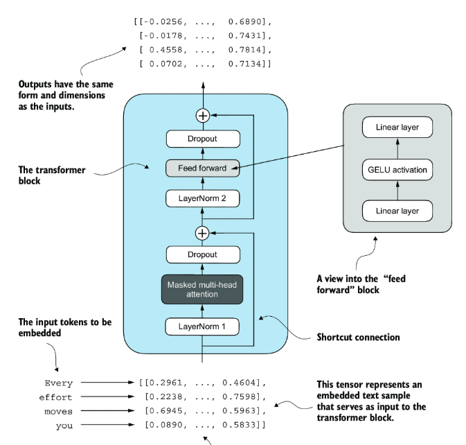

# The Transformer Architecture: A Comprehensive Technical Exposition
### 1.Introduction
The Transformer architecture, introduced by Vaswani et al. (2017) in the paper “Attention Is All You Need,” completely revolutionized the field of Natural Language Processing (NLP). By ditching recurrence and convolutions in favor of self-attention mechanisms, Transformers enabled much more efficient parallelization on modern hardware. This has allowed the training of massive language models such as BERT, GPT, and T5—models now powering cutting-edge applications like large-scale text generation and advanced conversational AI.

### 2. The Road to Transformers: Evolution from Sequential Models
Before Transformers dominated, recurrent-based models like RNNs, LSTMs, and GRUs reigned supreme for handling sequences:
* RNNs unfold over time steps, maintaining hidden states that get updated with each token.
* LSTMs and GRUs mitigate the vanishing and exploding gradient problems but still can struggle with very long sequences.
* These recurrent models are intrinsically sequential, making it difficult to parallelize.

#### 2.1 RNNs, LSTMs, and GRUs: Strengths and Weaknesses
Strength: They naturally handle sequence order.
Weakness: They are slow to train on long sequences (because of sequential steps), and they rely on a single hidden state to propagate context, which can become a bottleneck for long-range dependencies

### 2.2 Attention Mechanism: Breaking the Fixed-Length Bottleneck
The introduction of attention (Bahdanau et al., 2014) was a game-changer. Instead of compressing the entire input sequence into a single hidden state, the model could “attend” to specific segments of the input dynamically, using an alignment score and a weighted sum of encoder states.

### 2.3 Transformers: The Paradigm Shift
Transformers took attention to the next level with:
* Self-attention applied in both the encoder and decoder, enabling parallel processing of sequences.
* Positional encoding to handle word order without recurrence.
* Multi-head attention, letting different “heads” focus on different aspects of the sequence simultaneously.

These changes enabled training at previously unimaginable scales, unlocking the potential for massive language models.

### 3. Core Concepts of the Transformer Architecture
#### 3.1 Self-Attention Mechanism
Let’s say you’re building a language model that generates text, one word at a time.
Given the prompt:
```bash
“The cat sat on...”
```

You want your model to predict the next word: “the mat”.

But here’s the challenge: when the model is processing the word “mat,” how does it know what “sat” or “cat” meant earlier? How does it decide which past tokens are more important for predicting the next word?

This is exactly where self-attention shines.

##### 3.1.1 Query, Key and Value
Let’s focus on predicting “mat” in the sentence:
```bash
“The cat sat on the mat”
```

Each token creates three learned representations:
* Query (Q): What am I looking for?
* Key (K): What do I have to offer?
* Value (V): What content am I carrying?

These are generated using learned projection matrices:
Each token creates a query, and compares it with the keys of all other tokens using a similarity measure — dot product.
* There are three trainable parameter learn during the training.

```python
W_q = torch.nn.Parameter(torch.randn(d_model, d_model))
W_k = torch.nn.Parameter(torch.randn(d_model, d_model))
W_v = torch.nn.Parameter(torch.randn(d_model, d_model))
```

##### 3.1.2 Attention Score Calculation
To know how much attention a word like “mat” should pay to earlier words (“the,” “cat,” “sat,” etc.), we calculate dot products between its query and all previous keys:

$$
\text{score}_{i,j} = Q_i \cdot K_j = 
\sum_{k=1}^{d} Q_{i,k} \cdot K_{j,k}
$$

```python
attn_scores = queries @ keys.transpose(1, 2)
```

Next we do Causal Masking for Text Generation before passing to softmax, We’re doing auto-regressive generation, so when predicting the next word, we must not look into the future. Just like you don’t peek ahead when writing a sentence word by word.

We apply a causal mask to prevent this:
```python
self.register_buffer(
    'mask',
    torch.triu(torch.ones(context_length, context_length), diagonal=1)
)

attn_scores.masked_fill_(
    self.mask.bool()[:num_tokens, :num_tokens],
    float('-inf')
)
```
```bash
[[0, -inf, -inf, -inf],
 [0,    0, -inf, -inf],
 [0,    0,    0, -inf],
 [0,    0,    0,    0]]
```

All the scores above the diagonal are set to -∞ so the softmax turns them into 0 probability — preserving the left-to-right generation rule.

Dot products can become large when the embedding dimension d_k is high, leading to unstable gradients. So we scale the scores:
**Scaled Dot-Product Attention Score**\
$$
\text{score}_{i,j} = \frac{Q_i \cdot K_j}{\sqrt{d_k}}
$$

```python
scaled_scores = attn_scores / (keys.shape[-1] ** 0.5)
```
This keeps scores in a reasonable range, avoiding exploding softmax outputs.

##### 3.1.3 Softmax to Get Attention Weights
Now we apply softmax to convert scores into attention weights:

**Softmax Attention Weight**
$$
\alpha_{i,j} = \frac{e^{\text{score}_{i,j}}}{\sum_{k \leq i} e^{\text{score}_{i,k}}}
$$

```python
attn_weights = torch.softmax(scaled_scores, dim=-1)
```
Each row now sums to 1 — a probability distribution over how much attention each token pays to previous tokens.

We don’t want the model to overfit by always relying on the same tokens. So we add dropout:
```python
attn_weights = self.dropout(attn_weights)
```

##### 3.1.4 Context Vector: Weighted Sum of Values
Finally, each token gets a context vector — the result of summing all the value vectors, weighted by attention scores.

$$
Z_i = \sum_{j} \alpha_{i,j} \cdot V_j
$$

```python
context = attn_weights @ values  # (batch, seq_len, d_model)
```

Full code of causal attention, 
```python
class CausalAttention(nn.Module):
    def __init__(self, d_in, d_out, context_length,
                dropout, qkv_bias=False):
        super().__init__()
        self.d_out = d_out
        self.W_query = nn.Linear(d_in, d_out, bias=qkv_bias)
        self.W_key   = nn.Linear(d_in, d_out, bias=qkv_bias)
        self.W_value = nn.Linear(d_in, d_out, bias=qkv_bias)
        self.dropout = nn.Dropout(dropout)            
        self.register_buffer(
           'mask',
           torch.triu(torch.ones(context_length, context_length),
           diagonal=1)
        )             

    def forward(self, x):
        b, num_tokens, d_in = x.shape                   
        keys = self.W_key(x)
        queries = self.W_query(x)
        values = self.W_value(x)

        attn_scores = queries @ keys.transpose(1, 2)   
        attn_scores.masked_fill_(                    
            self.mask.bool()[:num_tokens, :num_tokens], -torch.inf) 
        attn_weights = torch.softmax(
            attn_scores / keys.shape[-1]**0.5, dim=-1
        )
        attn_weights = self.dropout(attn_weights)

        context_vec = attn_weights @ values
        return context_vec
```

#### 3.2 Multi-Head Attention (MHA)
Instead of one single attention calculation, Multi-Head Attention runs several (say, 8) independent self-attention mechanisms in parallel. Each head captures different relationship subspaces—for instance, one might focus on nouns, another on verbs, etc. The results are then concatenated and projected back to the model dimension.
$$
\text{MultiHead}(Q, K, V) = \text{Concat}(\text{head}_1, \dots, \text{head}_h) W^O
$$

```python
class MultiHeadAttentionWrapper(nn.Module):
    def __init__(self, d_in, d_out, context_length,
                 dropout, num_heads, qkv_bias=False):
        super().__init__()
        self.heads = nn.ModuleList(
            [CausalAttention(
                 d_in, d_out, context_length, dropout, qkv_bias
             ) 
             for _ in range(num_heads)]
        )

    def forward(self, x):
        return torch.cat([head(x) for head in self.heads], dim=-1)

torch.manual_seed(123)
context_length = batch.shape[1] # This is the number of tokens
d_in, d_out = 3, 2
mha = MultiHeadAttentionWrapper(
    d_in, d_out, context_length, 0.0, num_heads=2
)
context_vecs = mha(batch)
print(context_vecs)
print("context_vecs.shape:", context_vecs.shape)
```

#### 3.3 Transformer Archiecture
##### 3.3.1 Layer normalization
Training deep networks — especially those with many layer,
Transformer layers — can lead to:
- Exploding gradients
- Vanishing gradients
- Instability during optimization

LayerNorm stabilizes training by normalizing activations — making the learning dynamics smoother and more predictable.
Given an input vector, LayerNorm:
1. Computes the mean and variance across features (i.e., dimension d)
2. Normalizes the vector to have zero mean and unit variance
3. Applies learnable scale and shift to allow the model to adapt

The mean (or average) is a measure of the central value of a set of numbers.
$$
\mu = \frac{1}{n} \sum_{i=1}^{n} x_i
$$

The variance tells us how spread out the numbers are from the mean.
$$
\sigma^2 = \frac{1}{n} \sum_{i=1}^{n} (x_i - \mu)^2
$$

Normalization, 
$$
\hat{x}_i = \frac{x_i - \mu}{\sqrt{\sigma^2 + \epsilon}}
$$

The variable eps is a small constant (epsilon) added to the variance to prevent division by zero during normalization.
LayerNorm output step,
$$
y_i = \gamma \hat{x}_i + \beta
$$

```python
class LayerNorm(nn.Module):
    def __init__(self, emb_dim):
        super().__init__()
        self.eps = 1e-5
        self.scale = nn.Parameter(torch.ones(emb_dim))
        self.shift = nn.Parameter(torch.zeros(emb_dim))

    def forward(self, x):
        mean = x.mean(dim=-1, keepdim=True)
        var = x.var(dim=-1, keepdim=True, unbiased=False)
        norm_x = (x - mean) / torch.sqrt(var + self.eps)
        return self.scale * norm_x + self.shift
```
Technically speaking, Layer Normalization normalizes the activations across the feature dimension for each token. It keeps training stable and independent of batch size. Two main variants exist:
* Post-LN (Original Transformer) – LN is applied after the residual addition.
* Pre-LN (GPT-2, modern usage) – LN is applied before each sub-layer, often improving training stability without large learning-rate warm-ups.

##### 3.3.2 Feed-Forward Networks (FFN)
Even after tokens "talk" to each other through self-attention, we want each token to process its own information more deeply — for that, we use a token-wise MLP. Each position in the sequence goes through an identical two-layer feed-forward block with a non-linear activation. A neural network without activation functions is just a linear function (like a line). It can’t model complex relationships.
That’s why we use functions like:
- ReLU: max(0, x) → simple but harsh
- GELU: smoother, used in GPT

What does GELU do?
It keeps most negative values small, but doesn’t kill them entirely like ReLU.
```python
GELU(x) ≈ 0.5 * x * (1 + tanh(√(2/π) * (x + 0.044715 * x³)))
```
This allows:
- Smooth gradient flow
- Better performance in deep networks like GPT

```python
class GELU(nn.Module):
    def forward(self, x):
        return 0.5 * x * (1 + torch.tanh(
            torch.sqrt(torch.tensor(2.0 / torch.pi)) * 
            (x + 0.044715 * torch.pow(x, 3))
        ))

class FeedForward(nn.Module):
    def __init__(self, cfg):
        super().__init__()
        self.layers = nn.Sequential(
            nn.Linear(cfg["emb_dim"], 4 * cfg["emb_dim"]),  # Expand
            GELU(),                                          # Non-linear
            nn.Linear(4 * cfg["emb_dim"], cfg["emb_dim"]),   # Compress
        )

    def forward(self, x):
        return self.layers(x)
```
SwiGLU activation is anothe activation function used in this varient.

##### 3.3.3 
In deep neural networks:
- During backpropagation, gradients get smaller and smaller as you go back through the layers.
- Eventually, early layers get tiny gradients and learn very slowly — or not at all.
This is the vanishing gradient problem.

Instead of just feeding the output of a layer into the next layer, we also add the original input back in.
```python
output = layer(x)
x = x + output  # ← shortcut connection
```

Put together,


```python
class TransformerBlock(nn.Module):
    def __init__(self, cfg):
        super().__init__()
        self.att = MultiHeadAttention(
            d_in=cfg["emb_dim"],
            d_out=cfg["emb_dim"],
            context_length=cfg["context_length"],
            num_heads=cfg["n_heads"], 
            dropout=cfg["drop_rate"],
            qkv_bias=cfg["qkv_bias"])
        self.ff = FeedForward(cfg)
        self.norm1 = LayerNorm(cfg["emb_dim"])
        self.norm2 = LayerNorm(cfg["emb_dim"])
        self.drop_shortcut = nn.Dropout(cfg["drop_rate"])

    def forward(self, x):
 #1
        shortcut = x
        x = self.norm1(x)
        x = self.att(x)
        x = self.drop_shortcut(x)
        x = x + shortcut      #2

        shortcut = x         #3
        x = self.norm2(x)
        x = self.ff(x)
        x = self.drop_shortcut(x)
        x = x + shortc
```

#### 3.4  Modern Variants and Enhancements
##### 3.4.1  Normalization Alternatives (RMSNorm, etc.)
RMSNorm omits the mean-centering step of LayerNorm, focusing on the root mean square of activations. It can be faster and is used in large LLMs (e.g., LLaMA).

##### 3.4.2 Advanced Activation Functions (SwiGLU, GeGLU)
SwiGLU: Combines the Swish activation with a gating mechanism, often achieving better results in large-scale language models.

Potential Pitfalls: Higher risk of outliers with extremely large models trained in low precision (FP8), but modifications like Smooth-SwiGLU help.

##### 3.4.3 Attention Efficiency Improvements (Sparse, FlashAttention)
Sparse/Local Attention: Reduces complexity by restricting attention to local windows or learned patterns.

FlashAttention: A memory- and IO-optimized implementation of standard self-attention, significantly speeding up training without approximations.

##### 3.4.4 Stability and Scaling
Using Pre-LN architectures, combined with advanced normalization (RMSNorm) and carefully chosen activation functions, has proven essential for training models that scale to hundreds of billions of parameters.

## References
1. Vaswani, A., Shazeer, N., Parmar, N., et al. (2017) Attention Is All You Need. arXiv 1706.03762. [https://arxiv.org/abs/1706.03762](https://arxiv.org/abs/1706.03762)

2. Bahdanau, D., Cho, K. and Bengio, Y. (2014) Neural Machine Translation by Jointly Learning to Align and Translate. arXiv 1409.0473. [https://ar5iv.labs.arxiv.org/html/1409.0473](https://ar5iv.labs.arxiv.org/html/1409.0473)

3. He, K., Zhang, X., Ren, S., & Sun, J. (2016) Deep Residual Learning for Image Recognition. CVPR 2016. [https://arxiv.org/abs/1512.03385](https://arxiv.org/abs/1512.03385)

4. Hendrycks, D., & Gimpel, K. (2016) Gaussian Error Linear Units (GELUs). arXiv 1606.08415. [https://arxiv.org/abs/1606.08415](https://arxiv.org/abs/1606.08415)

5. Zhang, B., & Sennrich, R. (2019) Root Mean Square Layer Normalization. arXiv 1910.07467. [https://arxiv.org/abs/1910.07467](https://arxiv.org/abs/1910.07467)

6. Xiong, R., Yang, Y., He, D., et al. (2020) On Layer Normalization in the Transformer Architecture. Proceedings of Machine Learning Research. [https://proceedings.mlr.press/v119/xiong20b/xiong20b.pdf](https://proceedings.mlr.press/v119/xiong20b/xiong20b.pdf)

7. AutoDropout: Learning Dropout Patterns to Regularize Deep Networks. (2021) [https://ojs.aaai.org/index.php/AAAI/article/view/17127/16934](https://ojs.aaai.org/index.php/AAAI/article/view/17127/16934)

8. Dao, T., Fu, D.Y., Ermon, S., et al. (2022) FlashAttention: Fast and Memory-Efficient Exact Attention with IO-Awareness. [https://proceedings.neurips.cc/paper_files/paper/2023/file/8f1bacee31caf990a4f08d84f0ccb322-Paper-Conference.pdf](https://proceedings.neurips.cc/paper_files/paper/2023/file/8f1bacee31caf990a4f08d84f0ccb322-Paper-Conference.pdf)

9. Gu, J., et al. (2023) Pre-RMSNorm and Pre-CRMSNorm Transformers: Equivalent and Efficient Pre-LN Transformers. [https://openreview.net/forum?id=z06npyCwDq](https://openreview.net/forum?id=z06npyCwDq)

10. Yang, C., et al. (2023) ReLU² Wins: Discovering Efficient Activation Functions for Sparse LLMs. arXiv 2402.03804. [https://arxiv.org/abs/2402.03804](https://arxiv.org/abs/2402.03804)

11. Wang, T., et al. (2024) Enhancing Efficiency in Vision Transformer Networks: Design Techniques and Insights. arXiv 2403.19882. [https://arxiv.org/abs/2403.19882](https://arxiv.org/abs/2403.19882)

12. Zhang, Y., et al. (2024) Element-wise Attention Is All You Need. arXiv 2501.05730. [https://arxiv.org/html/2501.05730v1](https://arxiv.org/html/2501.05730v1)

13. Lu, P., et al. (2024) Peri-LN: Revisiting Layer Normalization in the Transformer Architecture. arXiv 2502.02732. [https://arxiv.org/html/2502.02732v1](https://arxiv.org/html/2502.02732v1)

14. Luo, Y., et al. (2024) The Mathematical Relationship Between Layer Normalization and Dynamic Activation Functions. arXiv 2503.21708. [https://arxiv.org/pdf/2503.21708](https://arxiv.org/pdf/2503.21708)

15. Dehghani, M., et al. (2024) A Survey of Transformers in NLP with Focus on Efficiency. arXiv 2406.16893. [https://arxiv.org/abs/2406.16893](https://arxiv.org/abs/2406.16893)

16. Fan, Z., et al. (2024) FlashAttention-3: Fast and Accurate Attention with Asynchrony and Low-precision. arXiv 2407.08608. [https://arxiv.org/abs/2407.08608](https://arxiv.org/abs/2407.08608)

17. Ruiz, N., et al. (2024) INT-FlashAttention: Enabling Flash Attention for INT8 Quantization. arXiv 2409.16997. [https://arxiv.org/abs/2409.16997](https://arxiv.org/abs/2409.16997)

18. Wang, P., et al. (2024) Scaling FP8 training to trillion-token LLMs. arXiv 2409.12517. [https://arxiv.org/abs/2409.12517](https://arxiv.org/abs/2409.12517)

19. Tao, Q., et al. (2024) Causal Language Modeling Can Elicit Search and Reasoning Capabilities on Logic Puzzles. arXiv 2409.10502. [https://arxiv.org/html/2409.10502v1](https://arxiv.org/html/2409.10502v1)

20. Van Nguyen, P., et al. (2024) Re-Introducing LayerNorm: Geometric Meaning, Irreversibility and a Comparative Study with RMSNorm. arXiv 2409.12951. [https://arxiv.org/html/2409.12951v1](https://arxiv.org/html/2409.12951v1)

21. Ren, C., et al. (2024) On the Nonlinearity of Layer Normalization. arXiv 2406.01255. [https://arxiv.org/pdf/2406.01255](https://arxiv.org/pdf/2406.01255)

22. Fang, Z., et al. (2024) Deriving Activation Functions Using Integration. arXiv 2411.13010. [https://arxiv.org/abs/2411.13010](https://arxiv.org/abs/2411.13010)

23. Liu, W., et al. (2024) Higher Order Transformers: Efficient Attention Mechanism for Tensor Structured Data. arXiv 2412.02919. [https://arxiv.org/abs/2412.02919](https://arxiv.org/abs/2412.02919)

24. Shi, Y., et al. (2024) FlashAttention on a Napkin: A Diagrammatic Approach to Deep Learning IO-Awareness. arXiv 2412.03317. [https://arxiv.org/abs/2412.03317](https://arxiv.org/abs/2412.03317)

25. Guo, Y., et al. (2024) UniForm: A Reuse Attention Mechanism Optimized for Efficient Vision Transformers on Edge Devices. arXiv 2412.02344. [https://arxiv.org/abs/2412.02344](https://arxiv.org/abs/2412.02344)

26. Wong, S., et al. (2024) Polynomial Composition Activations: Unleashing the Dynamics of Large Language Models. arXiv 2411.03884. [https://arxiv.org/html/2411.03884v3](https://arxiv.org/html/2411.03884v3)

27. Understanding How Positional Encodings Work in Transformer Model. (2024) ACL Anthology. [https://aclanthology.org/2024.lrec-main.1478.pdf](https://aclanthology.org/2024.lrec-main.1478.pdf)

28. "Mix-LN: Unleashing the Power of Deeper Layers by Combining Pre-LN and Post-LN." (2024) OpenReview. [https://openreview.net/forum?id=BChpQU64RG](https://openreview.net/forum?id=BChpQU64RG)

29. Recurrent Neural Networks (RNNs) Sequential Data Processing. Interview Kickstart. [https://interviewkickstart.com/blogs/learn/recurrent-neural-networks-sequential-data-processing](https://interviewkickstart.com/blogs/learn/recurrent-neural-networks-sequential-data-processing)

30. Transformer vs RNN in NLP: A Comparative Analysis. Appinventiv. [https://appinventiv.com/blog/transformer-vs-rnn/](https://appinventiv.com/blog/transformer-vs-rnn/)

31. The Illustrated Transformer – Jay Alammar. [https://jalammar.github.io/illustrated-transformer/](https://jalammar.github.io/illustrated-transformer/)

32. The Illustrated Retrieval Transformer - Jay Alammar. [https://jalammar.github.io/illustrated-retrieval-transformer/](https://jalammar.github.io/illustrated-retrieval-transformer/)

33. How Transformers Work: A Detailed Exploration. DataCamp. [https://www.datacamp.com/tutorial/how-transformers-work](https://www.datacamp.com/tutorial/how-transformers-work)

34. Complete Guide to Building a Transformer Model with PyTorch. DataCamp. [https://www.datacamp.com/tutorial/building-a-transformer-with-py-torch](https://www.datacamp.com/tutorial/building-a-transformer-with-py-torch)

35. The Annotated Transformer - Harvard NLP. [https://nlp.seas.harvard.edu/annotated-transformer/](https://nlp.seas.harvard.edu/annotated-transformer/)

36. Transformer (deep learning architecture) - Wikipedia. [https://en.wikipedia.org/wiki/Transformer_(deep_learning_architecture)](https://en.wikipedia.org/wiki/Transformer_(deep_learning_architecture))

37. Novel positional encodings to enable tree-based transformers - Microsoft. [https://www.microsoft.com/en-us/research/wp-content/uploads/2019/10/shiv_quirk_neurips_2019.pdf](https://www.microsoft.com/en-us/research/wp-content/uploads/2019/10/shiv_quirk_neurips_2019.pdf)

38. How Transformers work? - Hugging Face NLP Course. [https://huggingface.co/learn/nlp-course/chapter1/4](https://huggingface.co/learn/nlp-course/chapter1/4)

39. Transformers - Hugging Face. [https://huggingface.co/blog/Esmail-AGumaan/attention-is-all-you-need](https://huggingface.co/blog/Esmail-AGumaan/attention-is-all-you-need)

40. A Survey of Transformers - arXiv. [https://arxiv.org/pdf/2106.04554](https://arxiv.org/pdf/2106.04554)

41. LLM Transformer Model Visually Explained - Polo Club of Data Science. [https://poloclub.github.io/transformer-explainer/](https://poloclub.github.io/transformer-explainer/)

42. Transformer Models: Unveiling the Inner Workings - FastBots.ai. [https://fastbots.ai/blog/how-transformer-models-work](https://fastbots.ai/blog/how-transformer-models-work)

43. Transformer Encoder Decoder Explained. Restackio. [https://www.restack.io/p/transformer-models-answer-transformer-encoder-decoder-explained-cat-ai](https://www.restack.io/p/transformer-models-answer-transformer-encoder-decoder-explained-cat-ai)

44. Sebastian Raschka. 
   "*Build a Large Language Model (From Scratch)*." 
   [Link](https://www.manning.com/books/build-a-large-language-model-from-scratch)
